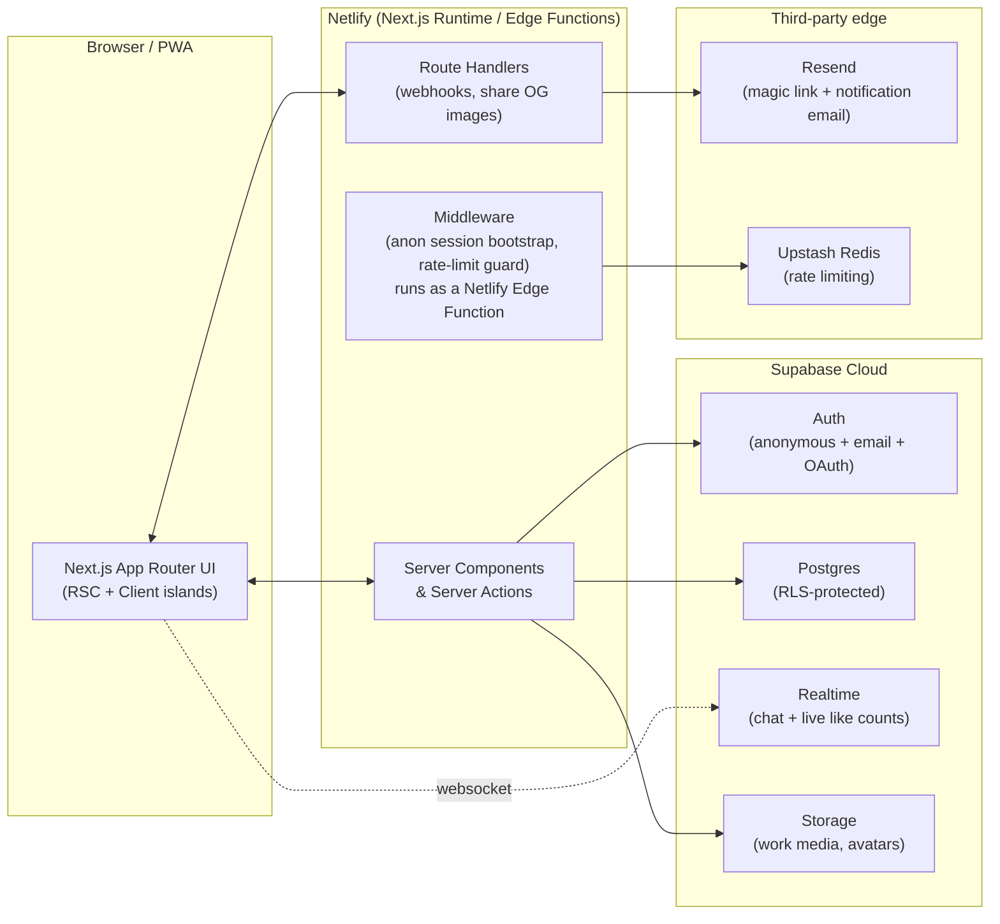
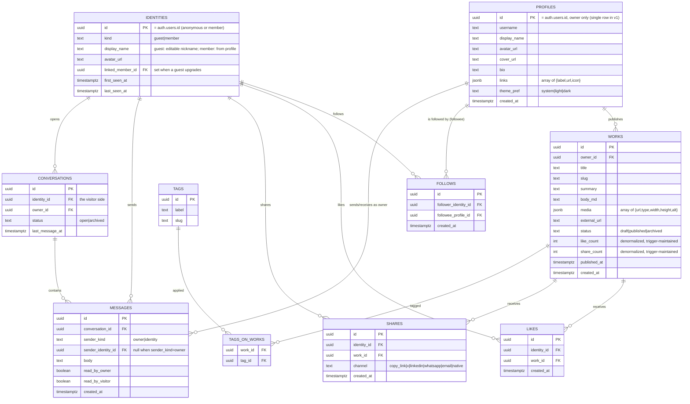

# YouLink — Architecture Blueprint

Treat this document as what a staff engineer would hand a team on day one: system shape, identity model, data model, and the contract for every feature. Written by role below so each concern is traceable.

---

## 1. Product Frame

**One owner, many visitors.** Unlike Facebook (many-to-many social graph), YouLink is a **creator-model, one-to-many** network: a single profile (you) publishes "works" (portfolio items); the world follows, likes, shares, and messages that one profile. This constraint is what keeps it "lite" — no friend graph, no multi-user feed ranking, no group/permissions matrix.

**Two visitor tiers, one data model:**

1. **Guest** — no sign-up. Gets a durable anonymous identity on first meaningful action (follow / like / message). Can do everything except manage a persistent profile or receive email notifications.
2. **Member** — signed up (email magic link or OAuth). Same actions as guest, plus: cross-device history, email notifications, profile (avatar/name) shown next to their likes/comments/messages.

A guest **upgrades** to a member without losing history (identity linking, §4).

---

## 2. System Architecture

**Why this shape:** Supabase collapses DB + auth + realtime + storage into one connection string and one policy language (Postgres RLS), which is the difference between "lite" and standing up four separate services. Next.js Server Actions remove the need for a hand-rolled REST/GraphQL API for anything the server itself can do; Route Handlers exist only for things Server Actions can't do (webhooks, dynamic OG image generation for share cards).

**Why Netlify over Vercel:** Vercel's Hobby (free) plan terms restrict usage to non-commercial projects; a portfolio that showcases paid work / drives client inquiries has commercial intent, which is a real ToS risk on a free Vercel plan. Netlify's free tier has no such restriction. The `@netlify/plugin-nextjs` runtime adapter supports App Router, Server Actions, Middleware-as-Edge-Function, ISR, and `next/image` optimization, so the architecture above is unchanged — only the hosting substrate differs.

---

## 3. Data Model (Postgres / Supabase)

**Notes:**
- `PROFILES` has exactly one row in v1 (the owner). Keeping it a table, not a config constant, means multi-tenant isn't a rewrite later — it's a migration.
- `IDENTITIES` is the unifying actor table: both anonymous guests and members are rows in Supabase `auth.users`; `IDENTITIES` mirrors the subset of fields the app needs without duplicating `auth.users`. Every `identity_id` foreign key works unchanged whether the actor is a guest or a member.
- `like_count`/`share_count` are denormalized onto `WORKS` via Postgres triggers on insert/delete of `LIKES`/`SHARES` — feed rendering never does a `COUNT(*)` join.
- Unique constraint `(identity_id, work_id)` on `LIKES` prevents double-likes; the UI treats a second "like" as an unlike (delete row).

---

## 4. Identity Model (Guest → Member)

1. First visit: middleware calls `supabase.auth.signInAnonymously()` if no session cookie exists. This issues a real Supabase JWT for an anonymous user — not a fingerprint hack. Cookie persists 1 year.
2. Guest follows / likes / messages: rows are written against that anonymous `identity_id`. No prompts, no friction.
3. Guest chooses to "Save my activity" or is prompted after 2+ actions: enters email → Supabase `linkIdentity`/OTP flow **upgrades the same user id** to a permanent account. No data migration needed — the UUID doesn't change, only `auth.users.is_anonymous` flips to `false`.
4. Cross-device claim (optional, Phase 4+): magic link sent to email lets the member's *other* device's anonymous identity merge in (re-parent `linked_member_id`, then union their likes/follows by `identity_id` rewrite in a single transaction).

This is the piece most "lite" clones get wrong (they use localStorage-only guest state, which loses everything on cache clear/device switch). Doing it via real anonymous auth rows means RLS, rate limiting, and moderation all apply uniformly to guests and members.

---

## 5. Feature Contracts

### Feed
- `GET` (RSC, cached w/ `revalidateTag('feed')`) — published works, newest first, cursor-paginated.
- Realtime: Supabase Realtime channel `works:changes` pushes new publishes to already-open tabs (toast: "New work posted ↑").

### Like
- Optimistic client update + Server Action `toggleLike(workId)`.
- RLS: any authenticated (incl. anonymous) identity may insert/delete **their own** like row; rate-limited to 30/min per identity via Upstash.
- Realtime: like_count changes broadcast on `works:{id}:likes` so open tabs see the count tick live (the "unprecedented" bit: watching a heart-burst animation replicate across viewers in near real time).

### Share
- Client-side native `navigator.share()` where available, else animated `ShareSheet` (copy link, X, LinkedIn, WhatsApp, email).
- Every open (not just successful share) beyond "copy link confirmed" logs a `SHARES` row via Server Action for analytics.
- Dynamic OG image per work (`app/works/[slug]/opengraph-image.tsx`) so shared links render a branded preview card, not a bare URL.

### Follow
- Single `FollowButton` — Server Action `toggleFollow()`. No approval step (public figure model).
- Follower count shown on profile; follower list is **not** publicly enumerable (privacy) — only the owner sees the list, in the dashboard.

### Chat
- `ChatDock` — persistent bottom-right launcher (desktop) / full-sheet (mobile), available on every public page, no page navigation required to start typing.
- First message from a fresh identity auto-creates a `CONVERSATIONS` row.
- Realtime via Supabase Realtime `broadcast` + `postgres_changes` on `messages` filtered by `conversation_id`.
- Owner inbox (`(owner)/dashboard/inbox`) lists all conversations, unread-first, with read receipts (`read_by_owner`/`read_by_visitor`).
- Abuse guard: Upstash rate limit (10 msgs/min/identity) + max message length + basic profanity/URL-spam heuristic before insert.

### Notifications ("Pulses")
- Owner-only in v1: toast (via Realtime) + bell dropdown for new follow/like/message.
- Email digest (Resend, daily) optional toggle in dashboard settings — avoids real-time email spam.

---

## 6. Security & Abuse Prevention

- **RLS everywhere** — no table is readable/writable without an explicit policy; default deny.
- **Rate limiting** at the Server Action boundary for every guest-writable action (Upstash sliding window).
- **Turnstile/hCaptcha** (Cloudflare Turnstile, free) on the first guest write of a session to block bot floods without adding friction for humans.
- **Content moderation**: message/comment body run through a lightweight profanity + link-spam filter before insert; owner can block an `identity_id` (soft ban — writes silently no-op).
- **Least privilege**: `service_role` key is server-only (never shipped to client), used solely inside trusted Server Actions/Route Handlers (e.g., moderation actions).

---

## 7. Performance Budget

- Lighthouse targets: **LCP < 1.8s, INP < 200ms, CLS < 0.05** on the public feed (mobile, 4G throttled).
- Images: Next/Image + Supabase Storage transform (`?width=`) → serve responsive, AVIF/WebP.
- Motion: all Framer Motion animations respect `prefers-reduced-motion`; heavy effects (parallax, particle backgrounds) degrade to static on reduced-motion or low-end device (via `navigator.deviceMemory` / `hardwareConcurrency` heuristic).
- Route-level code splitting; chat widget lazy-loads (`next/dynamic`) so it never blocks first paint.

## 8. Observability

- Netlify build/deploy logs + Netlify's built-in Core Web Vitals reporting.
- Supabase built-in query performance dashboard.
- Sentry (optional, Phase 5) for client + server error capture.

## 9. Deployment Topology

- `main` → Netlify Production context. Every PR → Netlify **Deploy Preview**, built against a Supabase **branch database** (Supabase preview branching) so schema changes are tested in isolation. Configured via `netlify.toml` (`[context.deploy-preview]` / `[context.production]` env overrides).
- Supabase migrations live in `supabase/migrations/`, applied via `supabase db push` in CI (GitHub Actions) before the Netlify deploy that depends on them.
- `@netlify/plugin-nextjs` (declared in `netlify.toml`) handles the Next.js → Netlify Functions/Edge Functions translation automatically — no custom server needed.
